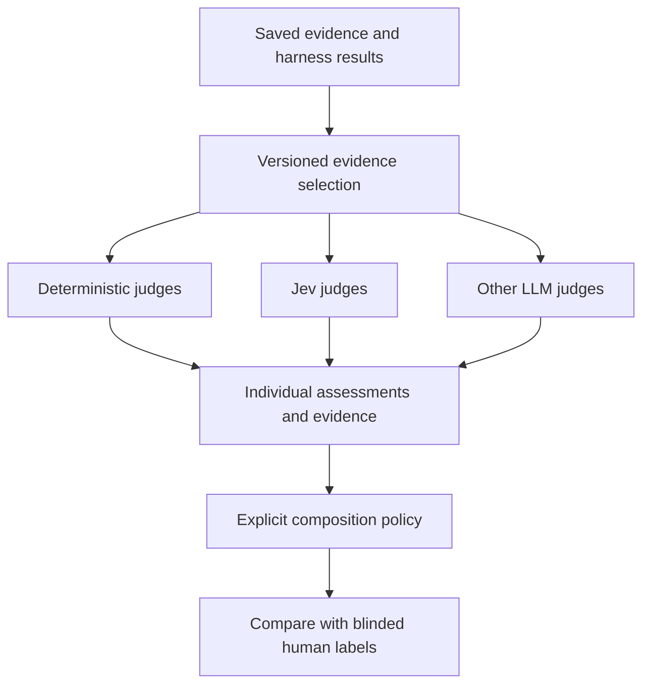

# TypeSafe as a Judge for Rehearse

Study date: **2026-09-17**. Status: **mixed-strategy judging is confirmed product
direction; Jev integration and its evaluation are deferred proposals**. No runtime
behavior is changed by this study. Repository and SDK revisions, local probes,
source coverage, and remaining empirical gaps are in the
[evidence record](typesafe-study/evidence.md).

## Recommendation

**Complete the current work to make Rehearse usable as it stands before starting
additional judging integrations.** The product owner's priority is usability of
the existing product; mixed-strategy judging is the next task after that work.
This study preserves the research and proposed approach for that later task.

For that follow-on task, **add Jev to the strategies considered for Rehearse's judging system, and test
the value it contributes alongside deterministic checks and other LLM judges.**
The product direction is a mix of strategies chosen for the criteria they
evaluate. Jev's API fits that direction; whether it adds reliable coverage at an
acceptable cost remains an experimental question. New Jev assessments should
initially be advisory while the existing decision policy remains authoritative.

The strongest opportunity is to let an engineer inspect many specific properties
of a saved attempt, revise a rubric without rerunning the coding agent, and
understand which results need closer review. That fits Rehearse's purpose:
testing whether an instruction improves an agent's work at an acceptable cost.
[Rehearse vision](vision.md).

Jev need not handle complete code-change or workflow assessments to be useful.
It can contribute focused judgments while other strategies cover their own
criteria. Adopting this API alone does not establish a competitive advantage;
the advantage would come from making instruction experiments easier and more trustworthy: preserved evidence,
useful checks, human calibration, and defensible comparisons.

| Question                                                 | Assessment                                                                                                     |
| -------------------------------------------------------- | -------------------------------------------------------------------------------------------------------------- |
| Can Jev produce judgments usable by Rehearse?            | Yes, at the API and data-model level.                                                                          |
| Is implementation likely to require a new agent runtime? | No. Grading can use a separate API while workers continue using Claude Code.                                   |
| Can heterogeneous judges share a result contract?        | Yes, with common evidence and provenance fields and strategy-specific results. The exact schema needs shaping. |
| Does Jev improve the existing combination of judges?     | Unknown; measure added coverage, errors, review work, and cost. No live Jev evaluations were run.              |
| Is it worth investigating?                               | Yes, particularly for narrow semantic checks and citation support.                                             |
| Is the provider integration a durable differentiator?    | Unlikely by itself. A validated instruction-testing workflow could be.                                         |

## Confirmed direction: judges use different strategies

The product owner has confirmed that judges comprise deterministic checks,
Jev-based evaluators, and evaluators using other LLMs. A case or workflow can
combine them. The [glossary](../GLOSSARY.md) already defines a Judge as a
deterministic check or rubric-scored LLM, and a session's check list as its judge.
Jev extends that family with a probabilistic evaluator whose output does not
include generated rationale.

| Strategy             | Suitable responsibilities                                                                                      | Result to preserve                                                                                  |
| -------------------- | -------------------------------------------------------------------------------------------------------------- | --------------------------------------------------------------------------------------------------- |
| Deterministic checks | Required words, recorded file/context inclusion, tool constraints, and executable checks where evidence exists | Observed result, exact evidence, and completeness; no invented model confidence.                    |
| Jev                  | Focused semantic classifications and rubric dimensions                                                         | Typed answer, probability distribution where available, question, and supplied evidence references. |
| Other LLMs           | Broader reasoning, semantic review, and written explanations                                                   | Criterion assessment, evidence claims, explanation, and model/configuration identity.               |

Deterministic implementation makes a check repeatable on fixed inputs; it does
not make its proxy a sufficient quality measure. Seeing a file-read event, for
example, establishes a recorded read, not that the agent understood or followed
the file. Evidence that is unavailable must remain distinguishable from a failed
criterion across all strategies.

Judges may assess different criteria, independently assess the same criterion,
or run conditionally. A cascade is one possible composition, not the required
architecture. Mandatory checks can gate acceptance, semantic dimensions can
remain separate, and disagreement on a shared criterion can prompt review.
No global majority vote or average should allow several favorable style scores
to override a failed correctness requirement.

This direction is settled. The shared result schema, attachment/configuration
format, and composition rules below are design proposals to shape before
implementation. The empirical question is which combinations serve each case.

## What the service provides

Jev accepts supplied text or JSON state and answers typed questions. It does not
generate explanations or inspect images, audio, or video. A request can evaluate
several questions against the same state. Each question is evaluated separately;
questions that depend on earlier answers require application logic and possibly
another request. [System One](https://docs.typesafe.ai/concepts/system-one),
[state](https://docs.typesafe.ai/concepts/state).

| Primitive | Meaning                                                                              | Potential Rehearse use                                                                      |
| --------- | ------------------------------------------------------------------------------------ | ------------------------------------------------------------------------------------------- |
| `Choice`  | One named option plus its probability distribution                                   | Classify a claim as supported, contradicted, or unsupported by supplied evidence.           |
| `Noul`    | Probability that a binary statement is true; no separate confidence field            | Estimate whether one precisely described defect occurs in an artifact.                      |
| `Score`   | Probability-weighted mean over ordered rubric levels, with the distribution retained | Rate the observability of one acceptance criterion or completeness of one handoff property. |

Choice can include an explicit insufficient-evidence option. This is preferable
to treating every uncertain binary answer as a demonstrated failure. Noul's
value of 0.5 means uncertainty between yes and no, not half-compliance.
[Choice](https://docs.typesafe.ai/primitives/choice),
[Noul](https://docs.typesafe.ai/primitives/noul).

A Score is not an ordinary integer grade. For levels 0, 1, and 2, a mean of 1
can describe certainty about the middle level or a split between the extremes.
Converting both to the same letter grade loses important information. Ordered
levels also do not establish equal distances in product value; any weighted
average is an application policy that needs justification.
[Score](https://docs.typesafe.ai/primitives/score).

The HTTP interface and official TypeScript SDK are sufficient for an adapter.
The local probe ran the SDK source under Bun 1.4.0 with a mock transport,
exercising mixed questions, explicit model selection, fractional scores, and an
overload retry. This establishes a working client path, not model accuracy or a
full production integration. [SDK source](https://github.com/typesafe-ai/typesafe-sdk-js),
[probe and boundaries](typesafe-study/evidence.md#local-sdk-probe).

## Where it fits the existing product

Rehearse already has several grading mechanisms. Session cases use deterministic
checks over replies and tool transcripts. Pipeline stages use sealed Claude
Judge calls over supplied artifacts and context; they do not roam the repository
with tools. The final code-change Judge receives baseline context, the diff,
and harness checks. Both model-Judge paths require evidence claims and a summary.
[Session checks](../src/benchmark/session-check.ts),
[stage grading](../src/benchmark/stage-grading.ts),
[final judging](../src/benchmark/judge.ts),
[output contracts](../src/benchmark/contracts.ts).

This makes the transport change relatively small. The substantive work is
deciding what each question measures and preserving the meaning of its result.

### Best first uses

**Semantic checks on saved replies and bounded artifact excerpts.** Rehearse can
already count words or recognize a tool call. It cannot thereby establish that
a brief preserves the required decision, that an acceptance criterion describes
an observable result, or that a handoff acknowledges an unverified claim.
These are useful candidates for narrow questions with labeled examples.
Session filesystem preservation and richer outcome grading remain planned,
so an initial trial must use evidence the record contains.
[Current limits](status.md#known-limitations).

**Checking whether a cited source supports a claim.** Today's citation validation
checks that a source/path is available. It does not establish that the cited
material entails the claim. A layered check can verify source identity and exact
quotes in code, then ask Jev whether the surrounding passage supports or
contradicts the claim. TypeSafe publishes a small worked example of this pattern;
it is evidence of a plausible mechanism, not a general accuracy estimate.
[Rehearse validator](../src/benchmark/judge.ts),
[TypeSafe citation cookbook](https://docs.typesafe.ai/cookbooks/citation_check).

**Triage for inspection.** If a saved reply claims success while the available
tool evidence is incomplete, Rehearse could surface that discrepancy for review.
Jev could help identify the semantic claim; the harness should interpret exit
codes and evidence completeness. TypeSafe's own agent-trace demonstration
classifies support-agent runs using conversations, tool calls, and final replies.
That is adjacent evidence, although support triage does not validate coding
correctness. [Agent trace evaluation](https://evals.typesafe.ai/agent_trace_observability).

**Rubric debugging.** Cheap regrading could expose criteria that react to harmless
paraphrases, conflate multiple requirements, or disagree with human labels.
Higher reported confidence alone is not evidence that a rewritten rubric is
better. Keep a separate set of cases for assessing rubric revisions.

### Responsibilities for other strategies

| Judgment                                          | Role in the combined judging system                                                                                              |
| ------------------------------------------------- | -------------------------------------------------------------------------------------------------------------------------------- |
| Complete implementation correctness               | Requires adequate repository evidence, executable checks, and often reasoning across several components.                         |
| Whether tests protect behavior                    | Test execution and integrity checks remain authoritative; semantic adequacy may require adversarial examples or mutation checks. |
| Overall maintainability or architectural quality  | Broad dimensions need a defensible decomposition and may retain irreducible reasoning requirements.                              |
| Whether a workflow instruction caused improvement | Requires controlled, repeated agent executions; regrading one output provides no new behavioral samples.                         |
| Visual quality                                    | Current Jev input is text-only.                                                                                                  |

The existing build rubric includes broad requirements such as persistence and
application wiring, correctness, maintainability, and test quality. Converting
each description mechanically into one question would preserve its complexity,
not solve it. The shape rubric offers narrower starting points, such as whether
a criterion states an observable outcome.
[Build rubric](../cases/audit-log/rubrics/build.json),
[shape rubric](../cases/audit-log/rubrics/shape.json).

## What confidence does and does not establish

TypeSafe's `confidence` summarizes the concentration of the returned
distribution. It is not a second independent measurement of correctness, and
the public confidence guide does not specify its exact formula. A value of 0.9
must not be presented as a demonstrated 90% chance that the grade is correct.
That interpretation would require empirical calibration for the relevant
question, data, and model version.
[Confidence documentation](https://docs.typesafe.ai/confidence).

Rehearse needs to distinguish three things:

1. **Uncertainty in one judgment:** the model's distribution over a supplied
   artifact and question.
2. **Variability between agent attempts:** how often the agent succeeds on fresh
   executions with frozen inputs.
3. **Uncertainty about an instruction's effect:** what the baseline/candidate
   comparison supports across repetitions and cases.

Jev supplies information for the first. It does not replace the other two.
Similarly, separately evaluated questions can share the same blind spot.
Do not multiply their probabilities as though their errors were independent,
or count many questions about one artifact as many independent experiments.

Confidence also needs to be interpreted relative to the decision. A distribution
spread between two acceptable grades may still put nearly all probability on
acceptable quality. A concentrated unacceptable grade is a confident failure.
An application may use probability mass on acceptable outcomes, evidence
completeness, and calibrated error rates together. A universal confidence cutoff
would discard these distinctions.

The existing human-agreement implementation is not yet a suitable independent
calibration dataset: when no finding explicitly contradicts an item, it inherits
the Judge's decision. That supports a review-by-exception workflow, but silence
does not establish that a human independently labeled the item. The trial needs
explicit, blinded labels, including unknown or disputed cases.
[Human-decision construction](../src/benchmark/judge-agreement.ts).

## Strength of the published evidence

TypeSafe launched public early access on September 15, 2026, two days before this
study. Its launch report attributes large speed and cost gains to structured
workflows, with acknowledged advantages from short inputs and comparisons that
make conventional models emit probabilities. Its zero-hallucination figure
concerns schema conformity. It does not show zero semantic mistakes.
[Launch report](https://typesafe.ai/blog/introducing-system-one-models-and-jev).

The published workflow evaluation uses four domains and large-model consensus
as its reference. The harness is assumed correct; reference models use high
thinking while compared models use provider defaults. This can support a claim
about agreement and efficiency under that setup. It cannot establish superiority
to human-reviewed Rehearse outcomes or distinguish model gains from all harness
design effects. [Evaluation methodology](https://evals.typesafe.ai/).

A self-consistency cookbook repeats fourteen questions on one insurance claim
fifteen times. It reports low variation but also probabilities crossing a binary
decision boundary. That is useful evidence for testing a review band; it is not
a determinism guarantee or a calibration study across independent cases.
[Self-consistency cookbook](https://docs.typesafe.ai/cookbooks/consistency_noul_cookbook).

The vendor's documented failure modes are directly relevant: literal
interpretation, unreliable arithmetic, multi-hop indirection, distraction from
irrelevant state, and susceptibility to adversarial material. The published
limits are 64k tokens across state and all questions, and 32k for state plus the
longest question. Choice supports up to 255 options; Score guidance recommends
at most ten distinct levels.
[Jev 1.13 limitations](https://docs.typesafe.ai/model-jaggedness/jev-1.13),
[Choice](https://docs.typesafe.ai/primitives/choice),
[Score](https://docs.typesafe.ai/primitives/score).

For Rehearse, a transcript is particularly challenging input: it contains
instructions, assertions about success, and possibly text aimed at an evaluator.
A classification output can be manipulated even though it cannot execute tools.
Explicit data boundaries and precise criteria help, but their effectiveness
must be tested. The study found no independent, human-labeled coding-Judge
benchmark that resolves this question for Jev. That is a coverage limitation,
not a claim that no such evidence exists anywhere.

## Economics and operational fit

The published price for `jev-1.13.0` is **$0.042 per million input tokens**, with
free output tokens. The following is arithmetic at that price, assuming the
token count includes the state and questions and excludes retries:

| Total input per request | One request | 1,000 requests |
| ----------------------- | ----------: | -------------: |
| 2,000 tokens            |   $0.000084 |         $0.084 |
| 10,000 tokens           |   $0.000420 |         $0.420 |
| 25,000 tokens           |   $0.001050 |         $1.050 |

The published limits are 1,200 requests/minute and 250,000 tokens/second, with
an explicit warning that they can change. Pin a versioned model rather than
`jev-latest`; the provider documents version IDs and response identity.
[Models and pricing](https://docs.typesafe.ai/models).

This makes broad semantic screening plausible. However, the bill for a useful
grade also includes evidence preparation, retries, reasoning-model escalation,
human review, and the engineer's time writing and calibrating the rubric.
For a cascade, estimate:

```text
grading cost = evidence preparation + Jev calls
             + escalation fraction × fallback cost + audit cost
```

A purely additive Jev judge increases evaluation cost; its benefit must be added
coverage, better decisions, or less human inspection work. Savings are possible
when a validated composition avoids other model calls or review work. Evaluate
both the marginal value of an addition and the cost of the complete composition.

For configurations that reduce existing Judge spending, savings have a ceiling.
If judging contributes a fraction `f` of a run's total cost and grading cost falls by a factor `s`, the total-cost ratio is
`(1 - f) + f/s`, before new overhead. For an illustrative `f = 0.10` and
`s = 100`, total savings are 9.9%, not 99%. Actual Rehearse-wide savings were not
measured. The larger benefit may be enabling checks that are currently omitted.

Latency must be measured from the user's environment with realistic packet
sizes and fallback rates. A fast API call will not necessarily make a long
coding-agent execution noticeably faster.

Operationally, this adds an API account and a separate data recipient to a local
tool. The privacy policy says inputs are not used for training and describes US
hosting. Public retention wording does not give a fixed deletion interval; the
docs offer enterprise zero-data-retention arrangements. Use public or synthetic
evidence first, and establish the intended account's retention arrangement
before routing private repositories or transcripts through it.
[Privacy policy](https://typesafe.ai/legal/privacy-policy),
[DPA](https://typesafe.ai/legal/data-processing),
[legal documentation](https://docs.typesafe.ai/legal).

## Integration approach

The recommended design has a common assessment record with strategy-specific
payloads and a separately configured decision policy. Common fields should
identify the criterion, strategy/configuration, evidence identity, execution
status, result, and resource usage where applicable. Distinguish a completed
assessment from execution failure, insufficient evidence, and a policy decision
to abstain. Preserve Jev distributions and LLM explanations in their native
forms; deterministic checks need neither a generated rationale nor a fabricated
confidence value. These are proposed responsibilities, not a finalized schema.

The first implementation should be a small offline path that evaluates frozen
evidence with the existing checks/LLM judges and an added Jev judge, saving their
individual assessments and the composition policy. Jev results initially remain
advisory. Establish that path before generalizing configuration across every
session and pipeline record.



After validation, one possible policy is a cascade: deterministic checks
first, Jev on eligible semantic questions, then a reasoning Judge or human when
evidence or prediction quality is insufficient. Preserve the original result
and the fallback result. Audit a sample of confidently accepted outputs too;
reviewing only uncertain outputs cannot reveal confident mistakes.

The integration has five substantive requirements:

1. **Preserve evidence identity.** Save exact state, source references, content
   hashes, rubric/questions, and the evidence-selection version. Distinguish
   unknown evidence from known absence. Retrieval can omit the decisive fact;
   for global claims, failure to retrieve it is not proof that it does not exist.
   A generated summary introduces another model whose errors and cost must be
   measured.
2. **Represent Jev results honestly.** Retain probabilities, expected score,
   provider confidence, requested/returned model, timing, usage, and validation
   errors. A selected source ID can identify an excerpt; it is not a generated
   explanation of why the judgment follows. Code can render the rubric, source,
   and result without inventing an evidentiary claim.
3. **Keep grading policy separate.** Current stage rules make hard blockers fail
   the stage, cap failed requirements at C, and take the worst dimension. A
   weighted average must not let polish compensate for a failed blocker.
   Uncertain semantic results need their own handling before an authoritative
   pass or stop is issued.
4. **Retain provider and failure provenance.** `JudgeInvoker` currently returns a
   Claude envelope, and `runJudgeAttempts` reads Claude metrics. Add a distinct
   adapter/result boundary instead of forging Claude output. Bound retries and
   cancellation; include failed attempts and unknown billed usage. The SDK's
   static types do not replace Rehearse's runtime validation: the local mock
   probe showed that missing answer keys pass through the SDK.
5. **Freeze the complete grading condition.** Provider/model identity alone is
   insufficient. Questions, evidence selection, thresholds, grade mapping, and
   fallback policy affect comparability. Regrade all comparison arms under a
   common condition; preserve previous assessments as historical records.

[Current grade policy](../src/benchmark/stage-grading.ts),
[Judge transport and attempts](../src/benchmark/judge-attempt.ts),
[comparability checks](../src/benchmark/comparison-comparability.ts),
[SDK client](https://github.com/typesafe-ai/typesafe-sdk-js/blob/66880ccded6cb642dc1809620c2b108c33730214/src/client.ts).

An offline Jev adapter is a bounded feature once evidence inputs are settled.
Making mixed-strategy judging configurable throughout the product involves
records, calibration, comparison logic, costs, and the UI. It should follow a
working example and preserve readers of existing records. The cheap API call
should not be mistaken for the total scope.

## Does this distinguish Rehearse?

Evaluation products already offer custom code scorers and model Judges.
Promptfoo documents rubric-based model grading; Braintrust supports custom
scorers; LangSmith combines code, model, and human evaluation.
[Promptfoo](https://www.promptfoo.dev/docs/configuration/expected-outputs/model-graded/llm-rubric/),
[Braintrust](https://www.braintrust.dev/docs/evaluate/write-scorers),
[LangSmith](https://docs.langchain.com/langsmith/evaluation-concepts).

| Product    | Relevant existing capability                                                                                                  | Implication                                                    |
| ---------- | ----------------------------------------------------------------------------------------------------------------------------- | -------------------------------------------------------------- |
| Promptfoo  | Its current Judge guide covers human-labeled calibration, held-out validation, multi-judge voting, and conditional regrading. | Calibration and escalation alone are not a unique proposition. |
| Braintrust | Custom numeric scorers and categorical classifiers can carry metadata.                                                        | A TypeSafe distribution can fit an extensible scoring system.  |
| LangSmith  | Annotation queues support rubric-based and pairwise human review.                                                             | Human adjudication is already a developed product workflow.    |

[Promptfoo Judge guide](https://www.promptfoo.dev/docs/guides/llm-as-a-judge/),
[Braintrust scorer contracts](https://www.braintrust.dev/docs/evaluate/write-scorers),
[LangSmith annotation queues](https://docs.langchain.com/langsmith/annotation-queues).

A competitor with a custom scorer interface could call the same public API.
Adding uncertainty or human review also does not establish an exclusive
capability. This study does not claim an exhaustive market survey or that these
products cannot implement Rehearse's workflow.

Rehearse can distinguish the experience around an engineer's decision:

- Turn an actual instruction failure into a repeatable case with inspectable
  evidence.
- Show which semantic requirements improved and which hard failures remain.
- Compare baseline, candidate, and minimal control under frozen conditions.
- Make cheap regrading useful without representing it as another agent trial.
- Accumulate consented, human-labeled coding-agent examples that reveal which
  graders can be trusted on which criteria.

For example, an engineer shortens a review skill. The outcome that matters is
whether it still detects known defects, avoids false alarms, and reduces total
cost on fresh attempts. Jev could cheaply compare each reported finding with
known defect evidence. Rehearse would supply the controlled experiment and the
decision record. That is a stronger product proposition than the provider name.

## A trial that can settle the next decision

**First compare grading approaches on saved evidence; then confirm product
benefit with fresh agent runs.** This keeps agent randomness out of the initial
Judge comparison without confusing regrading with instruction validation.

### Dataset and reference

Start with approximately 150 bounded evidence packets across reply quality,
acceptance criteria, handoffs, and known review findings. This is a proposed
discovery budget, not a statistically justified production certification size.
Include genuine failures and adversarial variants: polished wrong answers,
unsupported success claims, instruction injection, negation, missing evidence,
contradictory sources, and facts separated across the packet.

Use about 50 packets for question development and 100 held out for comparison.
Split by originating task or repository so paraphrases and related variants stay
together. Have humans label the criterion and supporting evidence without seeing
provider results or the instruction variant's identity; adjudicate disagreements
and preserve unresolved cases.

Treat this deliberately enriched collection as a **challenge set**. Its failure
rates and difficulty mix do not establish normal-workload calibration, automatic
coverage, fallback cost, or latency. For those estimates, collect a separate
sample representative of the intended workload, with its criterion/task mix and
sampling or weighting rule declared in advance. Keep that sample separate from
question tuning too. It may be collected during the fresh-run phase below;
until then, first-phase results support further experimentation rather than
authoritative promotion.

### Comparators

The primary comparison is the **existing combination with and without Jev**,
using the same frozen evidence and predeclared composition policy. Retain
deterministic gates in both. Measure errors that Jev catches beyond the baseline,
new false alarms, changes in unresolved cases, inspection effort, and added cost.
Removing Jev again should expose its marginal contribution; report overlapping
errors so agreement is not mistaken for independent corroboration.

As a control, add an economical conventional model to the same baseline with
the same atomic questions and evidence. Compare under a declared evaluation
budget or report the cost/quality tradeoff if budgets differ. Evaluate
conventional models with constrained structured outputs too. A deterministic-only
configuration, where meaningful, reveals what semantic judging contributes.
Test a Jev-plus-fallback policy separately if routing is part of the proposal.
These comparisons distinguish added evaluation work, better decomposition, and
Jev-specific value.

Measure the simpler decision-only baseline separately from a probability-enabled
one. If only the latter is worse, the result supports a narrower claim about
obtaining distributions. Repeat a subset to measure judgment stability, and
swap order in pairwise comparisons. Judge-bias research supports treating order,
verbosity, and self-preference as empirical issues.
[MT-Bench research](https://arxiv.org/abs/2306.05685),
[position-bias study](https://arxiv.org/abs/2406.07791).

### Measurements and decision gates

| Measure                                                                            | What it decides                                                             |
| ---------------------------------------------------------------------------------- | --------------------------------------------------------------------------- |
| False acceptance of human-labeled failures, by criterion and severity              | Whether the grader misses defects that matter.                              |
| False rejection and unresolved fraction                                            | Whether it creates unnecessary review work or loses useful coverage.        |
| Calibration, such as Brier score and reliability bins                              | Whether reported probabilities support routing on held-out data.            |
| Error versus automatic-coverage curve                                              | How much can be graded at each measured error tolerance.                    |
| Repeat and paraphrase stability                                                    | Whether harmless changes flip the decision.                                 |
| Evidence-support accuracy                                                          | Whether a plausible citation justifies the result.                          |
| Additional failures caught and new false alarms versus the same judges without Jev | Whether Jev contributes useful information beyond the existing combination. |
| Total cost and p50/p95 latency, including fallback                                 | Whether the proposed workflow improves the user's experience.               |
| Agreement with human decisions about paired instruction variants                   | Whether it preserves the decision Rehearse exists to inform.                |

Freeze the tolerable error margin and desired savings before opening held-out
results. Report challenge-set robustness separately from representative-workload
calibration and operational estimates. For example, a grader that escalates 80%
of failures and 10% of successes needs fallback on 45% of a half-failure challenge
set, but only 13.5% of a workload with 5% failures. The sampling mix changes the
estimated cost without changing the grader.

Use confidence intervals grouped by originating task, not a count that
treats many criteria on one packet as independent samples. Report performance
per criterion; a strong average must not hide failures on a critical slice.

Promote a criterion only when its held-out challenge results meet the predeclared
robustness policy and a workload-representative evaluation supports the intended
calibration, error tolerance, and cost or coverage benefit. If the sample
cannot resolve the comparison, continue in shadow mode or retain the existing
Judge. For scale, even zero false acceptances among 100 independent known-failure
cases leaves an approximately 3% one-sided 95% upper bound on that error rate;
our mixed 100-packet holdout would usually contain fewer failures. A small pilot
cannot justify a very low error claim.

Then run a small frozen instruction experiment with fresh agent attempts,
keeping worker model and effort fixed and including baseline/candidate/control.
Establish whether the proposed grading workflow preserves the human-supported
decision while changing cost or inspection effort. Keep final confirmation
cases separate from the examples used to select the instruction or tune the
Judge.

### What would change this recommendation

- If Jev adds useful coverage or reduces inspection work at an acceptable total
  cost and error rate, expand those checks and make saved regrading part of the
  product.
- If decomposition helps but an ordinary model is equally economical and more
  accurate on a criterion, use that strategy there; other criteria may still
  benefit from Jev.
- If Jev is useful for finding suspicious cases but unreliable for acceptance,
  retain it as an inspection aid.
- If evidence preparation or fallback consumes the benefit, stop the integration
  and prioritize artifact preservation and deterministic outcome checks.

## Follow-on work after current usability work

Once the current usability work is complete, the existing API research is
sufficient to shape a small working example. Define the common assessment record,
criterion attachments, and explicit composition policy around one case that
combines an existing deterministic check,
an LLM judgment, and an advisory Jev judgment. Preserve each result and its
evidence; keep mandatory-check behavior unchanged. Start with saved reply or
artifact evidence already available, rather than depending on unimplemented
session filesystem capture.

Run the held-out comparison above, including the same combination without Jev.
Use the result to choose where Jev earns an ongoing role and whether broader
configuration is worth building. Mixed-strategy judging remains the direction
even if Jev contributes little on the first criterion tested.
